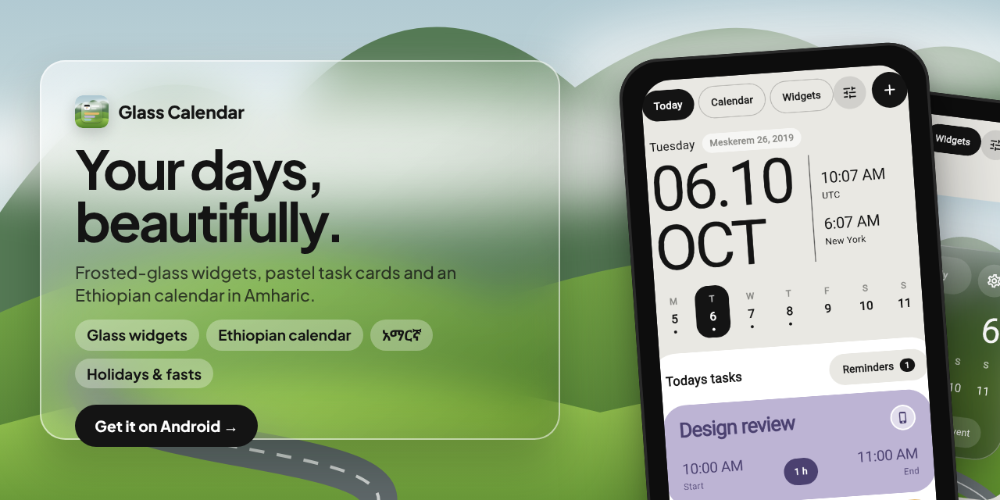
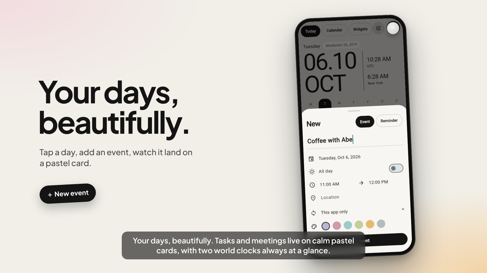

# Glass Calendar

<p align="center">
  
</p>

<p align="center">
  <a href="assets/video/glass-calendar-promo.mp4"></a><br>
  <sub>▶ <a href="assets/video/glass-calendar-promo.mp4">Watch the 53-second promo</a> · voiceover by Kokoro (Apache-2.0), voice <code>af_heart</code></sub>
</p>


A Flutter calendar that combines three design directions:

- **Today / Calendar** (pastel cards): big `06.10 OCT` date, two world clocks, coloured task cards with start / end / duration, and a month switcher with colour-coded day cards, hour columns and `+` slots.
- **Glass widget** (frosted glassmorphism): Weekly / Monthly toggle, big month + day, week strip with event dots, *Add Reminder* and *New Event* actions.
- **Island widgets** (black pills): week strip with event count, "Day 67%" hourly dot grid, and a *Next up* countdown card.

## Ethiopian calendar & Amharic

*Settings → Calendar & language* (or the last onboarding page) switches between the
**Gregorian** and **Ethiopian (ዓ.ም)** calendars, and between **English** and **አማርኛ**.

- Ethiopian mode regroups everything by Ethiopian months, including the 13th month
  ጳጉሜ (5 days, 6 in leap years): the month grid, day cards, glass and island
  widgets, the date picker and the Android home-screen widgets.
- The Today screen always shows the same day in the other calendar next to the weekday.
- Conversion lives in `lib/core/ethiopian.dart` (Julian Day Number based) and is
  tested against known dates (Enkutatash, Genna, Timket, Meskel, Pagume 6, Adwa).
- Phones set to Amharic start in Amharic + Ethiopian by default.

## Holidays & fasting

Toggle each group in *Settings → Holidays*:

- **Ethiopian public holidays**: Enkutatash, Meskel, Genna, Timket, Adwa, Labour Day,
  Patriots' Victory Day, Ginbot 20, Siklet and Fasika.
- **Orthodox feasts & fasts**: Demera, Ketera, Kana Zegelila, Hidar Tsion, Kulubi Gabriel,
  Debre Zeit, Hosanna, Erget, Peraklitos, Buhe, Filseta; fasting seasons Abiy Tsom (55 days),
  Nenewe, Hawaryat, Filseta, Nebiyat (Advent), Gahad, and the Wednesday/Friday fasts
  (lifted for the 50 days after Fasika). Fasika uses the Julian computus that Bahire Hasab follows.
- **Islamic holidays**: Mawlid, Eid al-Fitr, Eid al-Adha, from the tabular Hijri calendar;
  the observed date can move by a day with the moon sighting.
- **Monthly saints' days** (off by default): Selassie, Mikael, Kidane Mihret, Gabriel,
  Mariam, Giorgis, Medhane Alem, Bale Wold.

Logic and tests: `lib/core/holidays.dart`, `test/holidays_test.dart`.

## Sync with other apps

Events are read from, and written to, the phone's calendar database via
[`device_calendar_plus`](https://pub.dev/packages/device_calendar_plus). Anything
that syncs to the OS calendar (Google Calendar, iCloud, Outlook/Exchange, Samsung, …)
shows up automatically, and events created in the app can be saved straight into any
writable account. Calendars can be toggled on/off in *Settings*. Without permission
the app still works with local-only events and reminders.

## Home-screen widgets

| Platform | Status |
| --- | --- |
| Android | `GlassWidgetProvider` (frosted glass) and `IslandWidgetProvider` (black) in `android/.../CalendarWidgets.kt`, fed by `home_widget`. Use *Widgets → Add to home screen* in the app, or long-press the home screen. |
| iOS | Permissions and App Group id are set up (`group.com.kidyoh.glass_calendar`), but a WidgetKit extension target still has to be added in Xcode. |

Android widgets can't blur the wallpaper behind them (a platform limit), so the glass look
is a translucent tinted gradient with a luminous edge. The in-app glass widget uses a real
`BackdropFilter` blur.

## Store & social assets

- **Google Play listing** (fastlane `supply` layout, English + Amharic): `fastlane/metadata/android/{en-US,am}/`:
  feature graphic, icon, 7–8 phone screenshots, title and descriptions.
- **Banners**, three art directions (glass · pastel · night) × five sizes: `assets/banners/`.
- **GitHub social preview**: `.github/social-preview.png` (upload under Settings → Social preview).
- **Posters**, a numbered series (01 Today · 02 Calendar · 03 Widgets · 04 Ethiopian time · 05 Feasts & fasts) in square, portrait and wide: `assets/posters/`.
- **Promo video** 1920×1080, 53 s, real app interactions (taps, typing, live language switch) with narration: `assets/video/glass-calendar-promo.mp4`.
- Sources to regenerate all of it: `promo/`.

## Run

```bash
flutter pub get
flutter run            # Android / iOS device or emulator
flutter test
```
